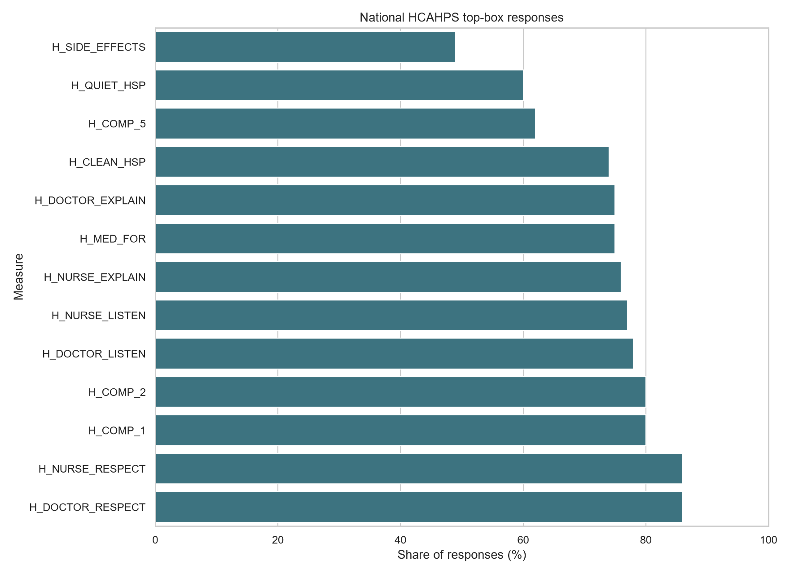
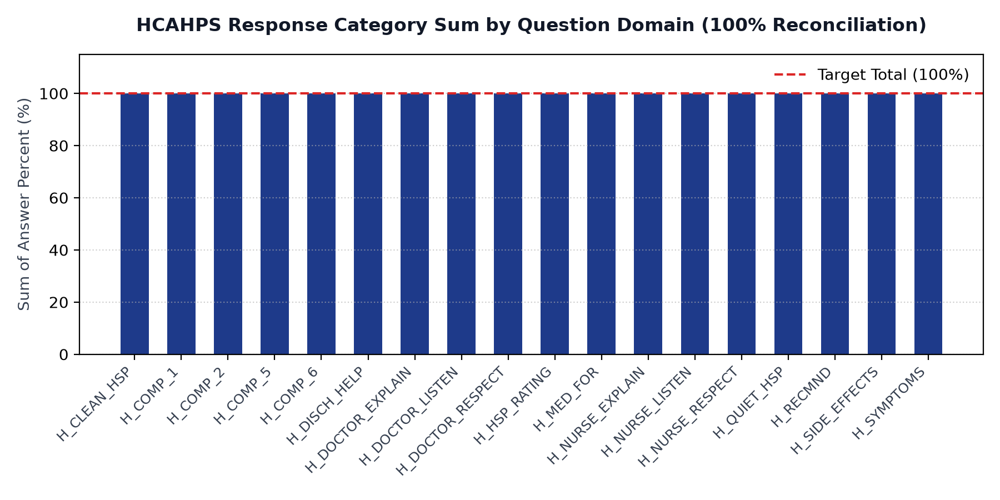

# CMS HCAHPS National Patient Experience Benchmark

I worked with the national roll-up of the HCAHPS hospital-experience survey, covering the October 2024 to September 2025 reporting window. 51 rows, one per measure. No hospitals, no regions, no time series — just the national number for each question. So I treated it as what it is: a benchmarking snapshot, and focused on getting the comparisons right.

## What the raw file gave me — and what it didn't

The export is 51 rows by 7 columns. Every row is one national answer percentage for one survey item. Response tiers (Always / Usually / Sometimes-Never, or Yes / No) live inside the measure IDs; I had to parse them out before any grouping made sense.

What stopped me from doing more: there is only one reporting period, so I skipped anything that looks like a trend. There are no provider IDs, so no rankings, no "best hospital" tables. And the footnote column is 100% empty in this cycle — I checked, then left it out of the model rather than carrying a dead field around.

## How I cleaned it

First pass: lowercase snake_case headers, trim whitespace, parse the two date columns, force `hcahps_answer_percent` to integer. Second pass, and the one that mattered: I split `hcahps_measure_id` into `question_group` (18 domains like H_NURSE_RESPECT, H_DOCTOR_LISTEN, H_CLEAN_HSP) and `response_code` (A / U / SN for Always / Usually / Sometimes-Never, plus Y / N on the yes-no items). Without that split the file is just 51 disconnected rows.

The one query worth keeping:

```sql
SELECT
    question_group,
    SUM(answer_percent) AS category_percent_sum,
    CASE WHEN SUM(answer_percent)=100 THEN 1 ELSE 0 END AS reconciles_to_100
FROM dbo.HCAHPS_National
GROUP BY question_group
ORDER BY question_group;
```

Every group should sum to exactly 100. If one doesn't, either my parsing is wrong or the source has a rounding problem. All 18 hit 100.

## Checks I ran before building anything

51 rows in Python, 51 distinct measure IDs in SQL. Min answer percent 4, max 88, nothing outside 0–100. The category sums above — 18 for 18 at exactly 100%.

## What stood out

Top-box means the most favorable answer — usually "Always". Doctor respect and nurse respect both sit at 86%, the top of the file. Communication composites (listen carefully, explain clearly) cluster in the mid-70s to 80. Then a visible drop: quietness at night at 60%, and staff describing medication side effects at 49%, the lowest top-box score in the set. That last one is the finding I'd flag to anyone running a unit — half of patients nationally say side effects weren't explained in a way they rate top-box.



And the reconciliation plot, because I don't trust a summary I can't reconcile — all 18 domains land exactly on the 100% line:



## What's in the folder

* [`raw_unedited/HCAHPS-National.csv`](raw_unedited/HCAHPS-National.csv) — the CMS export, untouched.
* [`data/cleaned/`](data/cleaned/) — cleaned CSV/XLSX plus the reconciliation table.
* [`notebooks/CMS_HCAHPS_National_analysis.ipynb`](notebooks/CMS_HCAHPS_National_analysis.ipynb) — the actual cleaning and checks.
* [`sql/CMS_HCAHPS_National.sql`](sql/CMS_HCAHPS_National.sql) — DDL plus the validation queries.
* [`dashboard/CMS_HCAHPS_National.pbix`](dashboard/CMS_HCAHPS_National.pbix) — standalone report with the processed 51-row dataset embedded; it opens without SQL Server or the raw export. Refreshing the report may require updating its processed-file location in Power Query.
* [`visuals/`](visuals/) — the two charts above.