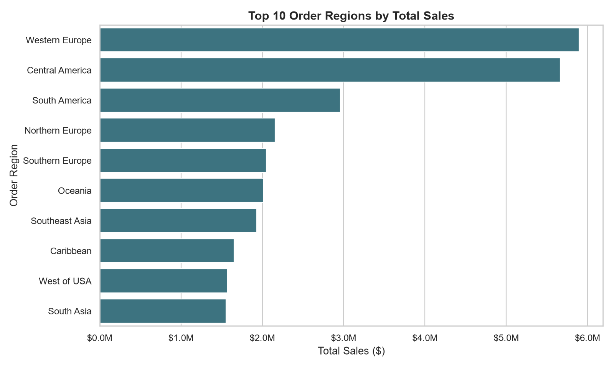
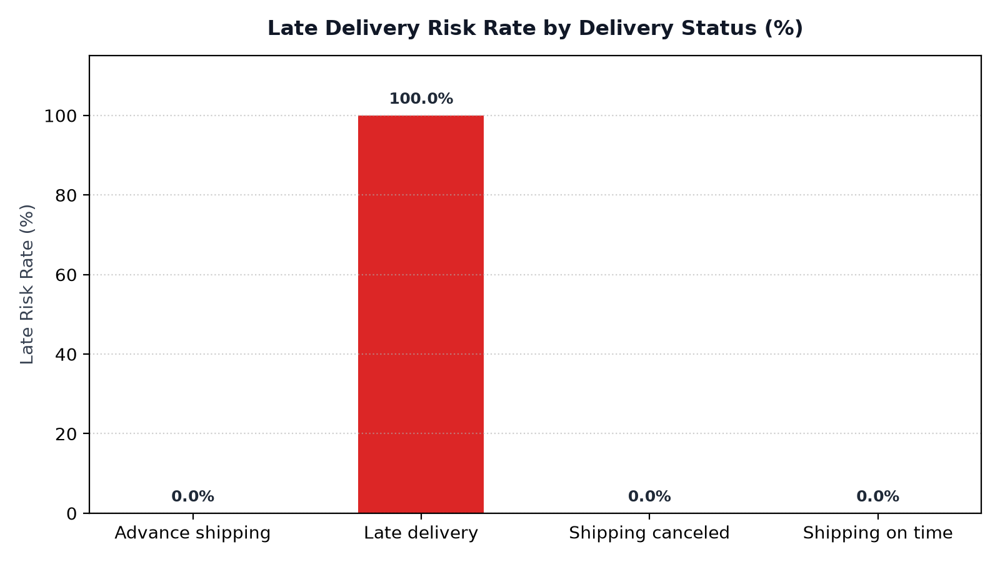

# DataCo Global — where the money is, and where the delays are

180,519 order-line rows. Each one is an item inside an order. My job: figure out which regions and categories actually drive revenue, and why more than half of everything shipped was at risk of arriving late. I also had to keep customer PII out of the analytic files entirely.

## The raw file, honestly

53 columns, latin1-encoded, one big Kaggle export. Two columns were dead on arrival: Product Description is empty in every single row, and Order Zipcode is missing for about 17% of orders. I left both in `raw_unedited/` for the audit trail and excluded them downstream — no point modeling a column with no values.

The PII situation needed care. The raw file has customer names, emails, passwords, street addresses. Those stay in `raw_unedited/` and nowhere else. The cleaned fact table carries only IDs and order attributes.

## What I did to it

`Order Item Id` is unique across all 180,519 rows, so that's the fact grain; `Order Id` ties items to orders (65,752 of them). I normalized the two DateOrders timestamps to ISO datetimes, and kept `Late_delivery_risk` as the binary flag it is — 1 means the item was at risk of missing its committed date, validated against the real-vs-scheduled shipping day counts.

```sql
SELECT
    [Order Region],
    COUNT(*) AS items,
    SUM(Sales) AS sales,
    SUM([Order Profit Per Order]) AS profit,
    AVG(CAST([Late_delivery_risk] AS float)) AS late_risk_rate
FROM dbo.DataCo_OrderItem
GROUP BY [Order Region]
ORDER BY sales DESC;
```

That region rollup is the query I kept coming back to. It answers both questions at once — revenue and risk.

## The numbers matched, so I moved on

Python and SQL agree: 180,519 items, 65,752 orders. Sales total $36,783,702.66, profit $3,972,779.43. Late-risk flag on 98,977 items — 54.83%.

## What the data actually says

Western Europe ($5.89M) and Central America ($5.67M) are the two biggest regions — together just over 31% of all revenue. South America sits at exactly half of Western Europe. The dashboard's bar chart makes the drop-off obvious.



On risk: the "Late delivery" status maps 1:1 to the risk flag (100% by definition), while advance shipping, canceled, and on-time shipments carry zero flagged risk. That sounds trivial, but it confirms the flag is derived cleanly from status rather than being a noisy separate signal — and with 54.83% of all items flagged, the operational problem is real regardless of how you slice it.



## What's in the folder

* [`raw_unedited/DataCoSupplyChainDataset.csv`](raw_unedited/DataCoSupplyChainDataset.csv) — original Kaggle extract, PII intact, untouched.
* [`data/cleaned/`](data/cleaned/) — de-identified analytic tables (CSV, XLSX).
* [`notebooks/DataCo_Supply_Chain_analysis.ipynb`](notebooks/DataCo_Supply_Chain_analysis.ipynb) — profiling, cleaning, charts.
* [`sql/DataCo_Supply_Chain.sql`](sql/DataCo_Supply_Chain.sql) — DDL, aggregates, category profit, 7-day rolling sales.
* [`dashboard/DataCo_Supply_Chain.pbix`](dashboard/DataCo_Supply_Chain.pbix) — standalone report with the processed 180,519-row dataset embedded; it opens without SQL Server or the raw PII-bearing extract. Refreshing the report may require updating its processed-file location in Power Query. The report has sales/profit/order/risk cards, a region slicer, and two bar charts.
* [`visuals/`](visuals/) — the two charts above.