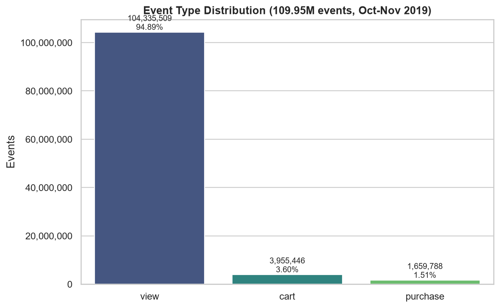
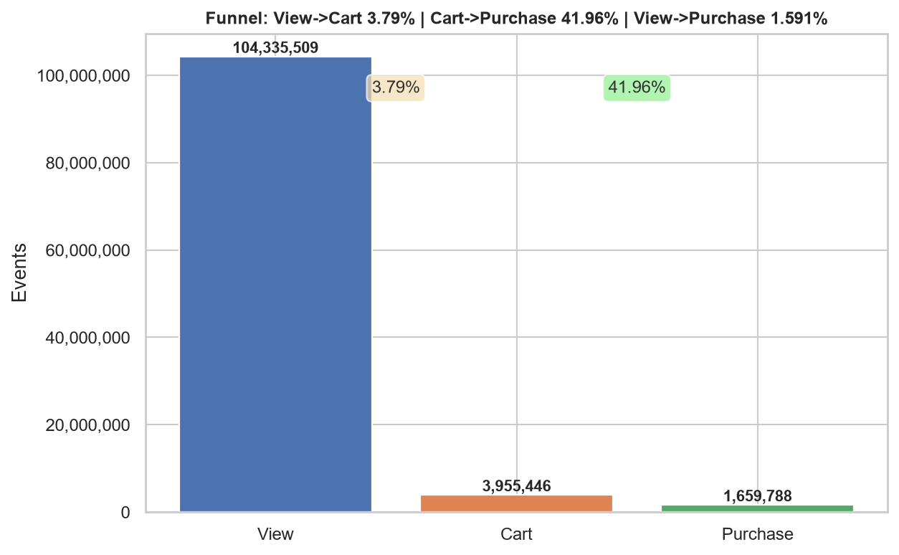
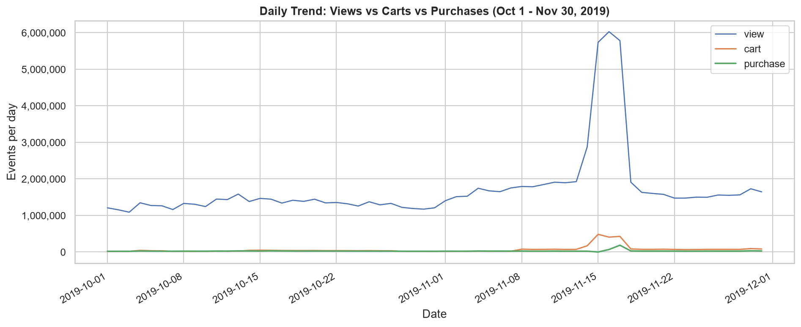

# Ecommerce Multi-Category Store Behavioral Analysis

## Overview
This project analyzes 109.95 million user interaction events (views, cart adds, purchases) collected from a multi-category e-commerce store between October 1 and November 30, 2019.

**Source:** Kaggle `mkechinov/ecommerce-behavior-data-from-multi-category-store` (version 8).

## Data Quality & Limitations
* **Dataset Volume:** 109,950,743 rows (~14.7 GB uncompressed across two monthly CSVs). Exceeds standard memory limits and Excel's 1,048,576 row capacity.
* **Missing Identifiers:** `brand` is missing in 13.95% of events (15,341,158 rows) and `category_code` is missing in 32.21% (35,413,780 rows). Rather than dropping rows or fabricating categories, these were flagged and assigned `'unknown'`.
* **Out-of-Range Anomalies:** 256,761 events recorded `price <= 0` (or $0.00). These were retained for audit transparency.
* **ID Precision:** `category_id` values exceed $2^{53}$ integer precision; casting to standard integers causes silent rounding, so `category_id` is strictly stored as string text.

## Data Cleaning & Transformation
1. **Streaming Architecture:** Built a high-performance Python streaming pipeline using 1,000,000-row chunks to clean the ~14.7 GB raw data within memory constraints.
2. **Feature Engineering:** Derived `PurchasePrice` (price for purchase events, 0 otherwise) and categorical `PriceBand` half-open bins ($0–10, $10–25, ..., $500+).
3. **Category Parsing:** Extracted multi-tier product hierarchies (`category_main`, `category_sub`, `category_detail`) from dot-delimited category codes.

## Folder Contents
* [`raw_unedited/README.txt`](raw_unedited/README.txt) - Source dataset documentation and schema specifications.
* [`data/cleaned/`](data/cleaned/) - Contains `Ecommerce_cleaned_sample_100k.csv` for fast exploratory modeling, plus data quality audit reports.
* [`notebooks/Ecommerce_analysis.ipynb`](notebooks/Ecommerce_analysis.ipynb) - Consolidated Jupyter notebook covering ETL, profiling, visualizations, and cross-checks.
* [`sql/Ecommerce.sql`](sql/Ecommerce.sql) - Production SQL Server ETL pipeline, schema definitions, and analytical query suite.
* [`dashboard/`](dashboard/) - Power BI project (`.pbip` format) and TMSL semantic model (`model.bim`).
* [`visuals/`](visuals/) - Exported chart graphics (`01_` through `09_`).

## Data Validation
54 automated reconciliation checks were executed across raw CSVs, intermediate parquet files, and SQL tables:
* **Row Reconciliation:** Verified exact match of 109,950,743 total events (Oct: 42,448,764; Nov: 67,501,979) with 0 dropped rows.
* **Event Funnel:** Views: 104,335,509 (94.89%) | Carts: 3,955,446 (3.60%) | Purchases: 1,659,788 (1.51%).
* **Conversion Rates:** View-to-Cart: 3.79% | Cart-to-Purchase: 41.96% | View-to-Purchase: 1.59%.
* **Financial Volume:** Total `PurchasePrice` generated: $505,152,392.77 (Average purchase price: $304.35).

## Key Visuals

### Event Type Distribution

### Conversion Funnel

### Daily Event Trend (Oct - Nov 2019)

