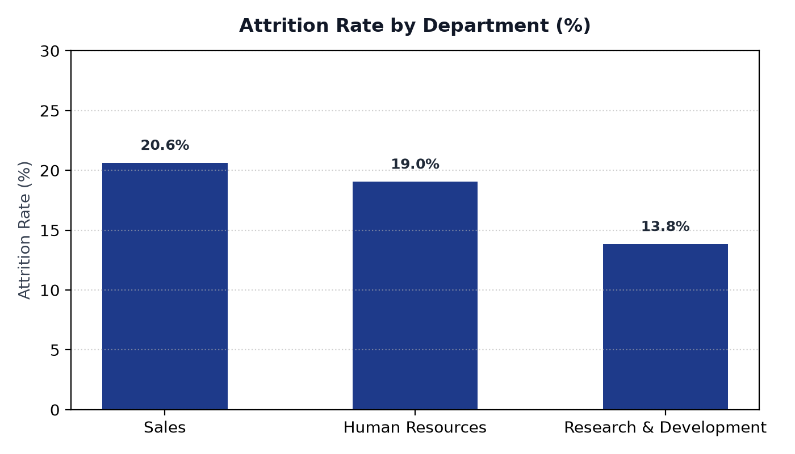
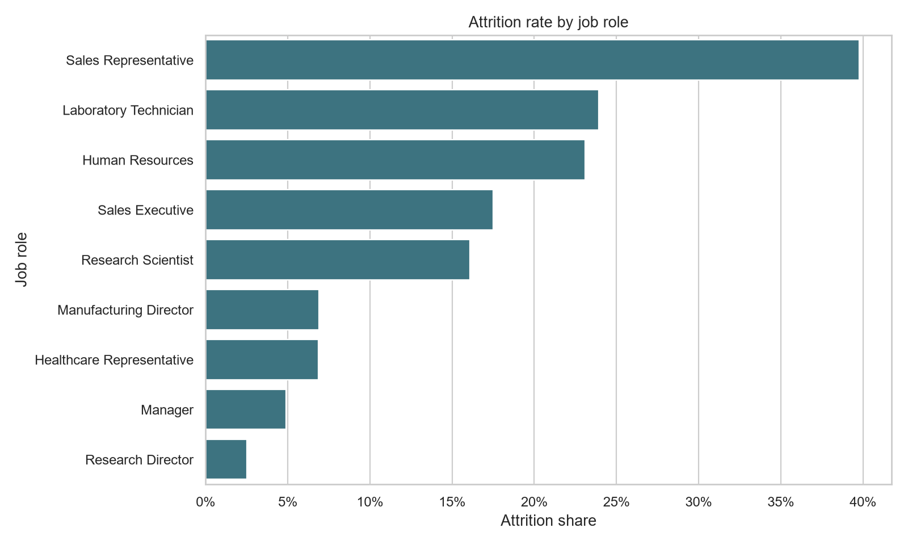

# IBM HR Attrition Analysis

1,470 employees, 237 of whom left, and I wanted to know *who*. The headline number is a company-wide attrition rate of 16.12%, but that average hides almost everything interesting - the real story is a 16x spread between the safest and least safe job roles in the business.

**Source:** Kaggle `pavansubhasht/ibm-hr-analytics-attrition-dataset` (v1), a simulated dataset built by IBM data scientists. None of these people are real.

## What the data looked like on arrival

1,470 rows and 35 columns, one row per employee, and honestly almost nothing to clean. I checked the usual things and they all came back flat:

* **Zero null cells.** Not one missing value anywhere in 51,450 cells.
* **Zero duplicate rows**, and `EmployeeNumber` is unique across all 1,470 records, so it works as a primary key.
* **Three dead columns.** `EmployeeCount`, `Over18` and `StandardHours` each hold a single value for every row (`1`, `N`, `80`). They cannot vary, so they cannot support any analysis. I left them in the CSV and dropped them from the BI model.
* **No temporal contradictions.** I checked whether anyone had been in their current role longer than they had been at the company, which would be a data-entry error. Nobody had.

So the cleaning step here was mostly *deliberate removal* rather than repair. The one transformation that mattered was bucketing `Age` into five bands, because the raw range (18-65) was too wide to plot meaningfully.

## What I found

The department view is the least interesting of the three, which is part of why I kept it as a slicer instead of a headline chart. Sales sits at 20.6% and HR at 19.0%, R&D at 13.8% - a real spread, but nothing you would act on.

The role breakdown is where it gets sharp. Sales Representatives churn at **39.8%**, Research Directors at **2.5%**. Sixteen times worse. Age moves the same way: under-25s leave at 39.2%, and that rate roughly halves for each decade up to 35-44 (10.1%) before ticking back up slightly at 55+ (15.9%).

I want to be careful about over-reading this. A role of 83 people (Sales Reps) and one with 2 exits out of 80 (Research Directors) are very different statistical strengths, and a naive ranking makes the small-sample roles look more certain than they are. The pattern is consistent enough across both department and age to be worth flagging to HR, but I would want tenure and exit-reason data before recommending any specific intervention.

## What is in the folder

* [`raw_unedited/WA_Fn-UseC_-HR-Employee-Attrition.csv`](raw_unedited/WA_Fn-UseC_-HR-Employee-Attrition.csv) - the original Kaggle file, untouched.
* [`data/cleaned/`](data/cleaned/) - cleaned CSV and XLSX, plus `IBM_HR_Attrition_role_summary.csv`, the aggregated role table that feeds the dashboard.
* [`notebooks/IBM_HR_Attrition_analysis.ipynb`](notebooks/IBM_HR_Attrition_analysis.ipynb) - the pandas pipeline and chart exports.
* [`sql/IBM_HR_Attrition.sql`](sql/IBM_HR_Attrition.sql) - SQL Server DDL and the four aggregation queries, written independently of the notebook.
* [`dashboard/IBM_HR_Attrition.pbix`](dashboard/IBM_HR_Attrition.pbix) - standalone report with the processed 1,470-row dataset embedded; it opens without SQL Server or the raw Kaggle file. Refreshing the report may require updating its processed-file location in Power Query. The report has one page, five KPI cards along the top, a Department slicer on the left, and two bar charts.
* [`visuals/`](visuals/) - the two charts embedded above.

## Data validation

I rebuilt the headline numbers in both Python and T-SQL and made sure they agreed, which is the only reason I trust a hand-off number:

| Metric | Python | SQL |
| --- | --- | --- |
| Rows | 1,470 | 1,470 |
| Distinct EmployeeNumber | 1,470 | 1,470 |
| Attrition count | 237 | 237 |
| Attrition rate | 16.12% | 16.12% |

The role ranking uses `RANK()` in SQL so the ordering is reproducible, rather than inheriting whatever order the engine happens to return.
