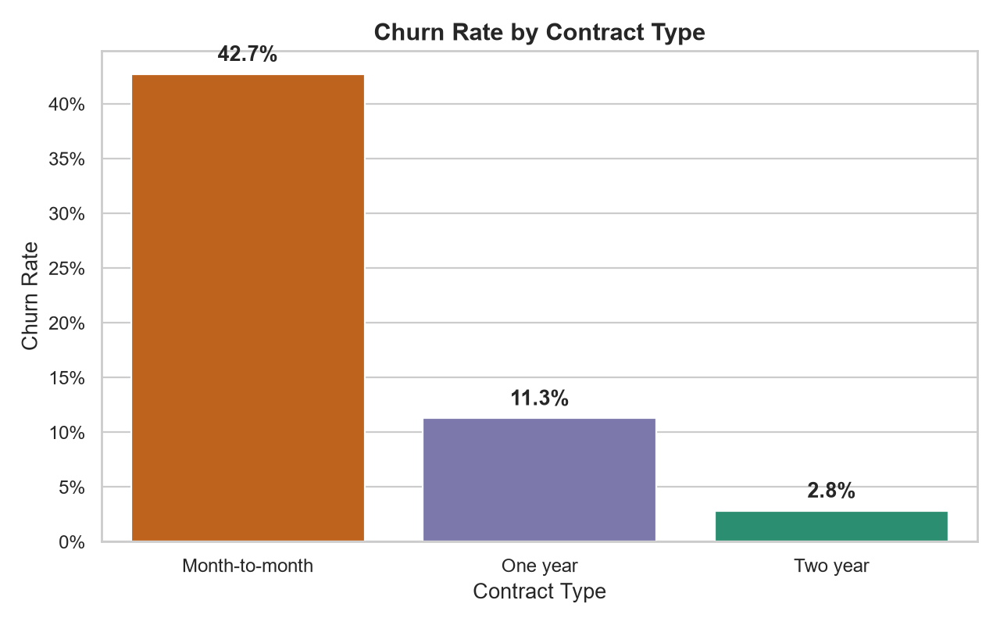

# Telco Customer Churn Analysis

## Overview
This project analyzes customer attrition for a telecommunications provider to identify key behaviors and contract structures associated with customer churn.

**Source:** Kaggle `blastchar/telco-customer-churn` (v1).

## Data Quality & Limitations
* **Format:** 7,043 rows and 21 columns, with each row representing an individual customer profile.
* **Missing Data:** 11 records contained blank strings in the `TotalCharges` field. Further inspection showed these belong to new customers with a `tenure` of 0 months who have not yet received their first invoice. Rather than imputing fake values, these were converted to NULL while retaining the rows.
* **Granularity:** The dataset represents a single cross-sectional snapshot; there are no timestamp columns, so time-series or trend analysis cannot be performed.

## Data Cleaning & Transformation
1. **Deduplication:** Confirmed zero duplicate records and verified `customerID` as a unique primary key.
2. **Numeric Conversion:** Converted `TotalCharges` to numeric float, properly casting blank strings to `null`.
3. **Categorical Profiling:** Evaluated churn rates across contract durations, internet service types, and payment methods.

## Folder Contents
* [`raw_unedited/WA_Fn-UseC_-Telco-Customer-Churn.csv`](raw_unedited/WA_Fn-UseC_-Telco-Customer-Churn.csv) - The original source data file.
* [`data/cleaned/`](data/cleaned/) - Cleaned analytical datasets (CSV, Excel format).
* [`notebooks/Telco_Customer_Churn_analysis.ipynb`](notebooks/Telco_Customer_Churn_analysis.ipynb) - Jupyter notebook containing data processing and analysis.
* [`sql/Telco_Customer_Churn.sql`](sql/Telco_Customer_Churn.sql) - SQL Server table DDL and analytical queries.
* [`dashboard/`](dashboard/) - Power BI project and semantic model (`.pbip` format).
* [`visuals/telco_churn_by_contract.png`](visuals/telco_churn_by_contract.png) - Exported chart visual.

## Data Validation
Key metrics were cross-checked between the Python environment and SQL queries:
* **Total Customers:** 7,043 unique accounts.
* **Churned Customers:** 1,869 customers.
* **Overall Churn Rate:** 26.54%.
* **Missing TotalCharges:** Exactly 11 records (0.16%).

## Key Finding

Month-to-month contract holders exhibit significantly higher churn (42.7%) compared to one-year (11.3%) and two-year (2.8%) contract holders:

