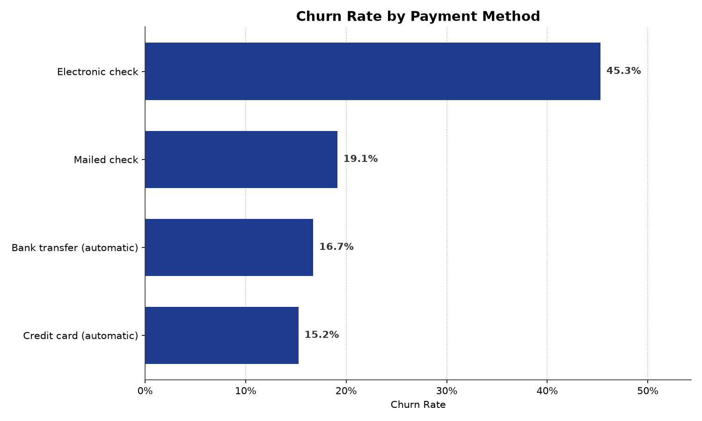

# Telco Customer Churn Analysis

7,043 customers, 1,869 of them gone. That's a 26.54% churn rate, and when I started breaking it down I expected it to be a spread-across-the-board retention problem. It isn't. One variable does most of the work: **contract type**. Month-to-month customers churn at 42.7%. Two-year customers churn at 2.8%. That is a 15x difference, and it is the finding the whole project turns on.

**Source:** Kaggle `blastchar/telco-customer-churn` (v1), a common telecom churn benchmark set.

## The one data problem worth naming

`TotalCharges` arrives as a *string*, not a number, and 11 of the 7,043 rows are blank. The tempting fix is to fill them with 0, the mean, or the median. I didn't, because all 11 have `tenure = 0` - they are brand new accounts that have not completed a billing cycle. They have genuinely never been charged anything. Zero would be a real number, the mean would be a lie, and either one would quietly corrupt any "average customer value" calculation.

So I converted the column to numeric with the blanks coerced to null and kept the rows. The SQL table defines `TotalCharges` as `decimal(12,2) NULL` for exactly this reason, with a comment saying why. The rows carry real information - their churn behaviour is still worth modelling - only the charge is unknown.

The rest was routine: zero duplicate rows, `customerID` unique across all 7,043 records, no other nulls, and no out-of-range values.

## The hard limit on this dataset

There are no date or timestamp columns. It's a single cross-sectional snapshot. So I did not build a retention curve, a cohort analysis, or a "churn is trending down" chart - there is no time dimension here to build one from, and inventing a fake one would be the most dishonest thing in the repo. The `tenure` column lets me say *when in the lifecycle* churn concentrates, but not *how churn is changing over time*.

## What the data says

Contract type is the headline:

Payment method is the runner-up, and it is the one I'd treat more carefully. Electronic check churns at 45.3% against 15.2% for automatic credit card. That looks like a strong signal, but the mechanism is confounded: electronic-check customers skew heavily toward month-to-month contracts, so this may be the contract effect wearing a different hat rather than an independent finding. I left it on the dashboard because it is genuinely useful for the retention team, but I would not present it as a standalone cause.

Tenure tells the same story from a third angle. Customers inside their first year churn at 47.4%; past two years, 14.0%. Churn is overwhelmingly a first-year problem, which lines up with the contract finding - the customers who leave are mostly the ones who never signed a long-term deal.

## What is in the folder

* [`raw_unedited/WA_Fn-UseC_-Telco-Customer-Churn.csv`](raw_unedited/WA_Fn-UseC_-Telco-Customer-Churn.csv) - the original Kaggle file, untouched.
* [`data/cleaned/`](data/cleaned/) - cleaned CSV and XLSX, with `TotalCharges` as a true numeric and the 11 new accounts preserved as nulls.
* [`notebooks/Telco_Customer_Churn_analysis.ipynb`](notebooks/Telco_Customer_Churn_analysis.ipynb) - the pandas pipeline: dedup check, the null investigation, baseline churn, and the contract chart.
* [`sql/Telco_Customer_Churn.sql`](sql/Telco_Customer_Churn.sql) - SQL Server DDL plus queries for contract, tenure, and payment-method churn.
* [`dashboard/Telco_Customer_Churn.pbix`](dashboard/Telco_Customer_Churn.pbix) - standalone report with the processed 7,043-row dataset embedded; it opens without SQL Server or the raw Kaggle file. Refreshing the report may require updating its processed-file location in Power Query. The report has one page, five KPI cards along the top, a Contract slicer on the right, and two bar charts.
* [`visuals/`](visuals/) - the two charts embedded above.

## Data validation

I recomputed the headline figures in both Python and T-SQL and required them to match before I'd quote any of them:

| Metric | Python | SQL |
| --- | --- | --- |
| Customers | 7,043 | 7,043 |
| Distinct customerID | 7,043 | 7,043 |
| Churned | 1,869 | 1,869 |
| Churn rate | 26.54% | 26.54% |
| Null TotalCharges | 11 | 11 |

The churn rate is a `0/1` average rather than a percentage of a pre-aggregated table, so Python and SQL are computing it by genuinely independent routes and still landing on the same number.
